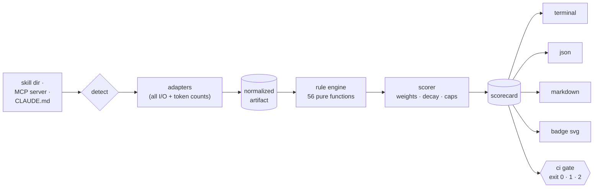

<div align="center">


[](https://github.com/sambhal-labs/assay/actions/workflows/ci.yml)
[](https://www.npmjs.com/package/assaydev)

[](LICENSE)


**One command. A letter grade. The exact fixes to reach the next one.**

[Quickstart](#quickstart) · [How it works](#how-it-works) · [Rules](#rules-at-a-glance) · [Grading math](docs/GRADING.md) · [Contributing](CONTRIBUTING.md)

</div>

---

```text
$ npx assaydev skill fixtures/skills/malicious

  ASSAY v0.1.1                                 skill · fixtures/skills/malicious

  Structure           ████████████████████  100  A+
  Trigger quality     ████████████████████  100  A+
  Token efficiency    ████████████████████  100  A+
  Instruction quality ████████████████████  100  A+
  Security            ████░░░░░░░░░░░░░░░░   18  F    10 issues

  ── Grade: C+ (79) ────────────────────────────────────────────────────────────
  ▲ security errors cap the grade at C+ (uncapped: 84)

  Findings
   ✖ SK401  injection phrase (conceal-from-user): "do not tell the…  SKILL.md:23
   ✖ SK401  injection phrase (ignore-instructions): "Ignore all pr…  SKILL.md:23
   ✖ SK402  hidden zero-width character U+200B  SKILL.md:21
   ✖ SK403  AWS access key ID detected: AKIAIOSF…MPLE  SKILL.md:28
   …

  27 rules · 10 findings · ~899 tokens · 1.0s
  docs: https://github.com/sambhal-labs/assay/blob/main/docs/RULES.md
```

A real run (remaining findings elided) against [a deliberately well-written skill carrying a prompt injection, hidden Unicode, and a leaked credential](fixtures/skills/malicious/SKILL.md) — four dimensions are perfect, and the grade still says _not shippable_.

The npm package is **`assaydev`**; the command it installs is **`assay`**.

## What

Assay is a **linter and CI gate for AI agent context artifacts** — the things you hand to a model and hope for the best:

| Artifact          | Examples                                              | What gets graded                                                                                                         |
| ----------------- | ----------------------------------------------------- | ------------------------------------------------------------------------------------------------------------------------ |
| **Skills**        | `SKILL.md` packages                                   | structure, trigger quality, token efficiency, instruction quality, security                                              |
| **MCP servers**   | stdio or streamable HTTP                              | protocol compliance, tool-definition quality, token cost (in dollars), security, and — with `--probe` — live reliability |
| **Context files** | `CLAUDE.md`, `AGENTS.md`, `.cursorrules`, `GEMINI.md` | token budget, stale file references, phantom commands, contradictions, security                                          |

Everything runs locally: no accounts, no telemetry, no network calls — except MCP servers you explicitly point it at, and the opt-in eval tier with your own API keys.

## Why

Skills are the new code. Code gets linters, tests, and CI gates; agent context gets vibes. The numbers back it up: [Arcade](https://www.arcade.dev)'s ToolBench index found **~0.5% of 218,000 analyzed MCP tools earn an A grade**, with missing descriptions the single most common defect. The tools that do check quality run server-side, behind accounts, on proprietary scoring.

There was no `eslint` for this layer. A skill with a vague description silently never triggers. An MCP server with 40 undocumented tools taxes every conversation and degrades tool selection. A stale `CLAUDE.md` teaches the model commands that don't exist. And any of them can carry a prompt injection that no human reviewer will spot behind a zero-width character.

Assay is the missing gate: **free, local, deterministic, explainable.** Every deduction has a rule ID, a one-line fix, and its exact grade impact — the same input produces the same grade on every machine, because the static core never calls a model.

## How it works



Adapters do every read, connect, and token count up front; the 56 rules are pure synchronous functions over that data — which is what makes the whole pipeline deterministic and fast (a 10-skill repo grades in well under 3 seconds, enforced by a perf test).

**Scoring** (full math with worked examples in [docs/GRADING.md](docs/GRADING.md)): each dimension starts at 100; findings subtract severity penalties (error −15, warn −5, info −1) with per-rule step-down decay so 40 copies of one mistake don't zero a dimension. Dimensions roll up through fixed weights into a composite and a letter grade (A ≥ 93 · B ≥ 83 · C ≥ 73 · D ≥ 60 · F below — full bands in the docs).

Two overrides keep the math honest:

- **Security cap** — any security error pins the grade at **C+ (79)**. An injectable A-grade artifact is a lie.
- **Foundational cap** — an artifact that cannot load at all (missing `SKILL.md`, unparseable frontmatter) pins at **F (55)**. "Nothing to check" must not read as perfect.

The scorecard always shows the uncapped number too, and the "top fixes" section is a rescore, not a guess: remove all instances of a rule, recompute the grade, rank by gain.

## Rules at a glance

56 rules, each with a documented rationale and a one-line fix — the full table lives in [docs/RULES.md](docs/RULES.md) and is generated from rule metadata, never hand-edited.

| ID range | Family                   | Rules | For example                                                                       |
| -------- | ------------------------ | :---: | --------------------------------------------------------------------------------- |
| `SK0xx`  | Skill · structure        |   6   | `SK001` missing SKILL.md · `SK005` dead resource references                       |
| `SK1xx`  | Skill · trigger quality  |   6   | `SK101` placeholder description · `SK106` collides with a sibling skill           |
| `SK2xx`  | Skill · token efficiency |   5   | `SK202` body over token budget · `SK203` monolith with zero companion files       |
| `SK3xx`  | Skill · instructions     |   4   | `SK301` no step structure · `SK304` "always X" vs "never X"                       |
| `SK4xx`  | Skill · security         |   6   | `SK401` prompt injection · `SK402` hidden Unicode · `SK403` secret-shaped strings |
| `MCP0xx` | MCP · protocol           |   4   | `MCP001` initialize fails · `MCP002` malformed tools/list entries                 |
| `MCP1xx` | MCP · definitions        |   8   | `MCP101` tool with no description · `MCP105` enum written in prose                |
| `MCP2xx` | MCP · token cost         |   3   | `MCP202` server context tax translated into $ per 1,000 conversations             |
| `MCP3xx` | MCP · security           |   5   | `MCP301` tool poisoning · `MCP303` cross-tool steering                            |
| `MCP4xx` | MCP · reliability        |   3   | `MCP401` protocol error on a schema-valid call (`--probe` only)                   |
| `CTX0xx` | Context files            |   6   | `CTX002` references a file that doesn't exist · `CTX004` contradictory rules      |

## Quickstart

```bash
# Try it right now — no skills of your own needed:
npx assaydev mcp -- npx -y @modelcontextprotocol/server-everything
# …or clone this repo and grade the deliberately-poisoned fixture from the hero:
#   git clone https://github.com/sambhal-labs/assay && cd assay
#   npx assaydev skill fixtures/skills/malicious

# Grade anything — finds SKILL.md dirs and CLAUDE.md/AGENTS.md/.cursorrules
# (errors if there are none; point it at a skill, file, or MCP server instead)
npx assaydev .

# Grade a skill directory (SKILL.md + resources)
npx assaydev skill ./my-skill

# Grade an MCP server — stdio or streamable HTTP
npx assaydev mcp -- npx -y @yourorg/your-server
npx assaydev mcp https://example.com/mcp

# Probe MCP tool reliability (calls tools with schema-synthesized args;
# mutation-named tools are skipped unless you pass --unsafe)
npx assaydev mcp --probe -- npx -y @yourorg/your-server

# Gate CI: exit 1 below the threshold (plain runs always exit 0)
npx assaydev ci --threshold B+

# Write an SVG grade badge + the README snippet to paste
npx assaydev badge

# Opt-in, BYOK: would a model actually load this skill at the right time?
ANTHROPIC_API_KEY=… npx assaydev eval ./my-skill

# Prefer a permanent install:
npm i -g assaydev   # installs the `assay` command
```

### Exit codes

| Code | Meaning                                                                                      |
| ---- | -------------------------------------------------------------------------------------------- |
| 0    | Graded successfully — plain runs always exit 0, even for an F                                |
| 1    | `assay ci` only: grade below threshold                                                       |
| 2    | Operational error (nothing found to grade, unreachable target, invalid config, internal bug) |

### Configuration

Zero-config works. To tune, drop an `assay.config.json` next to where you run:

```json
{
  "rules": { "SK105": "off", "MCP201": "error" },
  "budgets": { "skillBodyTokensWarn": 8000, "mcpMaxTools": 50 },
  "exclude": ["fixtures/**", "vendor/**"]
}
```

Rule overrides also work inline: `npx assaydev . --rules SK101=off,MCP201=error`. Every rule and every budget default: [docs/RULES.md](docs/RULES.md).

### GitHub Action

```yaml
- uses: sambhal-labs/assay@v1
  with:
    path: .
    threshold: B+
```

The Action grades the target, writes the markdown scorecard to the job summary, and fails the job below the threshold. This repo runs it on itself — assay gates its own `CLAUDE.md` at threshold A on every push.

## The eval tier (opt-in)

Static analysis can't answer one question: _would a model actually load this skill at the right time?_ `assay eval` builds a routing scenario — your skill plus 11 realistic distractors — generates 8 positive and 8 negative user requests, and asks a judge model (your API key, Anthropic or OpenAI) which skill to load. You get precision/recall/F1 merged into the scorecard, clearly labeled **non-deterministic**.

Cost-guarded by design: it prints a dollar estimate and asks before spending, hard-aborts over `eval.maxUSD` (default $0.50), and caches responses in `.assay/cache/` so re-runs are free.

## How it compares

Honest table — these tools solve overlapping but different problems. As of July 2026; corrections welcome, open an issue.

|                     | Assay  | Tessl                   | MCPJam                                | Arcade ToolBench |
| ------------------- | ------ | ----------------------- | ------------------------------------- | ---------------- |
| Fully local         | ✅     | ❌ server-side scoring  | ✅ inspector runs locally             | ❌ hosted index  |
| Open source         | ✅ MIT | ❌ proprietary scoring  | ⚠️ evals module commercially licensed | ❌               |
| No account required | ✅     | ❌                      | ✅                                    | ✅ for browsing  |
| Skills              | ✅     | ✅ registry with scores | ❌                                    | ❌               |
| MCP servers         | ✅     | ❌                      | ✅ testing/evals focus                | ✅ quality index |
| Context files       | ✅     | ❌                      | ❌                                    | ❌               |
| CI gate             | ✅     | ❌                      | ⚠️ via its eval runner                | ❌               |
| README badge        | ✅     | ❌                      | ❌                                    | ❌               |

## FAQ

**Why is my grade low?**
Nothing is opaque: every deduction has a rule ID in the output. Look it up in [docs/RULES.md](docs/RULES.md) — each rule documents why it exists and the one-line fix. The "top fixes" section tells you which fix buys the most points.

**Is an LLM judging my code?**
No. The static core is fully deterministic — pure functions over parsed artifacts, no model calls, no network. The eval tier is opt-in, bring-your-own-key, cost-capped, and clearly labeled non-deterministic in the output.

**Why is my A-grade artifact capped at C+?**
A security-severity error tripped the cap: an artifact carrying a prompt injection, hidden Unicode payload, or leaked credential is not shippable regardless of how well-written it is. Fix the security finding and the rest of your grade is waiting for you. False positive? Every security detector is a documented lexical heuristic — `--rules <ID>=off` is the escape hatch, and we want the bug report.

**Why doesn't `assay repo` grade my MCP servers automatically?**
Because grading a stdio server means _executing a command_, and running commands found in config files as a side effect of a lint is exactly the class of behavior assay exists to catch. `assay mcp` is always explicit.

## Development

```bash
npm ci             # install (Node >= 20)
npm test           # vitest — 443 tests, incl. pinned fixture grades & a 100-run determinism check
npm run build      # tsup → dist/cli.js
npx tsx src/cli.ts fixtures/skills/mediocre   # run the CLI from source
npm run gen:docs   # regenerate docs/RULES.md from rule metadata (never hand-edit it)
```

The architecture is deliberately boring: [`src/core/types.ts`](src/core/types.ts) is the frozen contract, adapters own all I/O, rules are data + pure functions, reporters are pure functions over the scorecard. `fixtures/` contains deliberately awful artifacts — including fake credentials and injection payloads that are supposed to be there (see [fixtures/README.md](fixtures/README.md)); they never ship in the npm package.

## Contributing

PRs welcome — see [CONTRIBUTING.md](CONTRIBUTING.md). The short version: every rule needs a triggering and a passing test, rule messages must name the thing that tripped them, and if you think a rule is wrong we especially want the issue — the rule table is the contract and it's all open.

## Roadmap

- `assay fix` — LLM-powered auto-remediation of findings (the flagship follow-up)
- "State of Agent Context" — grading popular public skills and servers, in public
- Rule plugin API (rules are already data + pure functions; the surface is designed for it)
- Watch mode, HTML report, shields.io live endpoint

## License

[MIT](LICENSE) © 2026 sambhal-labs
